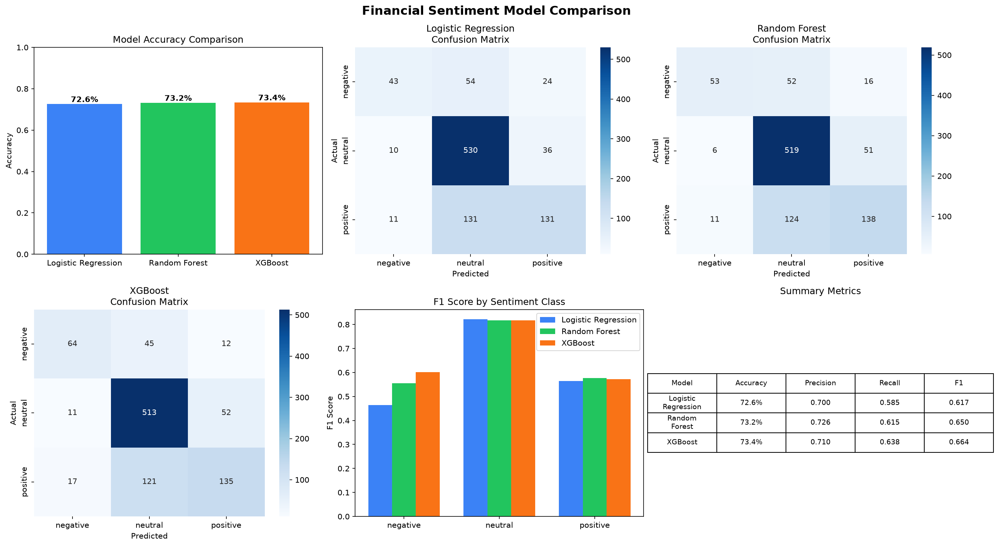
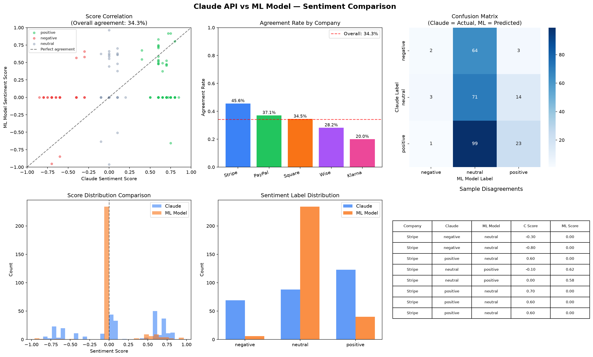
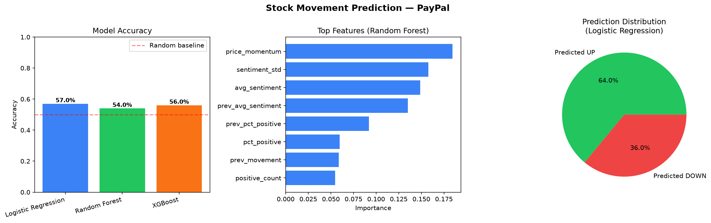
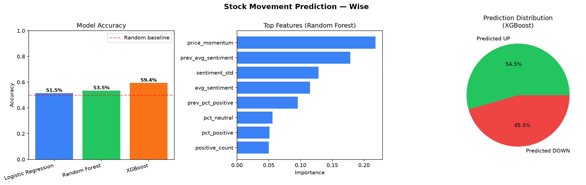
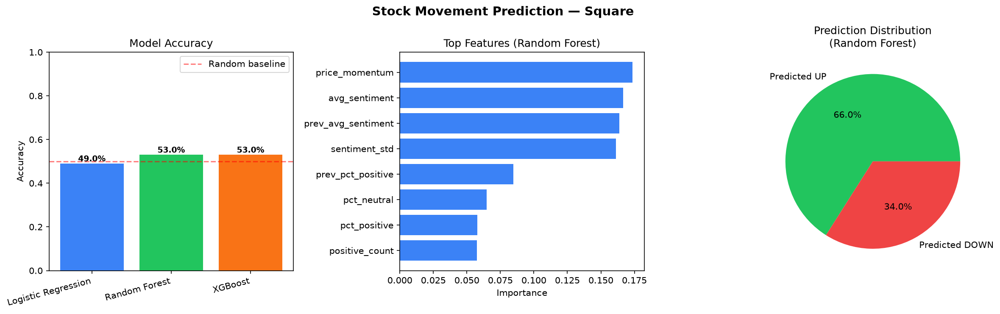

# Fintech Competitive Intelligence Dashboard & Stock Movement Predictor

An end-to-end data and ML pipeline that tracks fintech news, analyzes sentiment using both Claude AI and custom-trained ML models, and predicts stock price movement.

---

## Projects Overview

### Project 1 -- Fintech Competitive Intelligence Dashboard
Automated news pipeline tracking 5 fintech companies, using the Claude AI for sentiment analysis and surfacing insights in an interactive Streamlit dashboard. 

**Companies tracked:** Stripe, Wise, Square, PayPal, Klarna

### Project 2 -- Sentiment-Driven Stock Movement Predictor
NLP-powered ML pipeline that trains a financial sentiment classifier on a benchmark dataset, fetches 2 years of real stock data, and predicts daily stock price movement direction.

**Companies tracked:** Paypal (PYPL), Wise (WISE.L), Square (XYZ)

---

## Features

**Project 1:**
- **Automated news collection:** pulls the latest articles from 150,000+ sources via NewsAPI
- **AI-powered analysis:** uses the Claude API to score sentiment (-1.0 to 1.0), extract key themes, and generate plain-English summaries for each article
- **SQL data layer:** stores all articles and analysis results in a structured SQLite database
- **Interactive dashboard:** built with Streamlit and Plotly, featuring:
  - Sentiment scores and positive/negative breakdown by company
  - Daily sentiment trends over time with company filtering
  - Top themes per company
  - Browsable article feed with AI summaries, filterable by company and sentiment

**Project 2:**
- Financial sentiment classifier trained on the Financial PhraseBank NLP benchmark (4,846 sentences)
- Compared Logistic Regression, Random Forest, and XGBoost: XGBoost achieved 73.4% accuracy
- Stock movement predictor trained on 2 years of real price data with sentiment features
- Regularization applied to prevent overfitting: reduced overconfident predictions from 97% to ~55%
- Live predictor that scores today's real articles and outpus UP/DOWN predictions with confidence scores
- Claude vs ML model comparisons: quantified agreement rate (34.3%) showing LLM superiority for naunced NLP

---

## Visualizations

### Sentiment Model Comparison (Project 2)


### Claude API vs ML Model Sentiment Agreement


### Stock Movement Predictions




---

## Tech Stack

| Layer | Tools |
|---|---|
| Data collection | Python, NewsAPI, yfinance, `requests` |
| AI analysis | Claude API (`claude-sonnet-4-6`) |
| NLP / ML | scikit-learn, XGBoost, TF-IDF vectorization |
| Data storage | SQLite, `pandas` |
| Dashboard | Streamlit, Plotly |
| Visualization | matplotlib, seaborn |
| Model persistence | joblib |
| Environment | `python-dotenv` |

---

## Project Structure

| File | Description |
|---|---|
| 01_collector.py | Pulls articles from NewsAPI and stores in SQLite |
| 02_analyzer.py | Sends articles to Claude API for sentiment analysis |
| 03_analytics.py | SQL queries for insights (terminal output) |
| 04_dashboard.py | Streamlit dashboard |
| 05_ml_model.py | Trains NLP sentiment classifier |
| 06_stock_movement.py | Trains stock movement predictor |
| 07_live_predictor.py | Live predictions using saved models |
| 08_model_comparison.py | Claude vs ML model comparison |
| .env.example | Environment variable template |
| README.md | Project Overview |

---

## Setup & Installation

**1. Clone the repository**
```bash
git clone https://github.com/petall-io/fintech-intelligence.git
cd fintech-intelligence
```

**2. Create a virtual environment**
```bash
python -m venv venv

venv\Scripts\activate
```

**3. Install dependencies**
```bash
pip install requests pandas anthropic streamlit plotly python-dotenv schedule scikit-learn xgboost yfinance matplotlib seaborn joblib
```

**4. Set up environment variables**

Copy `.env.example` to `.env` and fill in your API keys:
```bash
cp .env.example .env
```

```
CLAUDE_API_KEY=your-claude-api-key
NEWS_API_KEY=your-newsapi-key
```

- NewsAPI: [newsapi.org](https://newsapi.org)
- Claude API key: [console.anthropic.com](https://console.anthropic.com)

**5. Download the Financial PhraseBank dataset**
Download `all-data.csv` from [Kaggle](https://www.kaggle.com/datasets/ankurzing/sentiment-analysis-for-financial-news) and place it in the project folder

---

## Running the Project

### Project 1: Dashboard

```bash
python 01_collector.py         # Collect news articles
python 02_analyzer.py          # Score sentiment with Claude AI (run multiple times if needed, will pick up where you left off)
python 03_analytics.py         # View insights in terminal
streamlit run 04_dashboard.py  # Launch Dashboard
```
### Project 2: ML Pipeline

```bash
python 05_ml_model.py         # Train sentiment classifier
python 06_stock_movement.py   # Train stock movement models
python 07_live_predictor.py   # Run live predictions
python 08_model_comparison.py # Compare Claude vs ML model
```

---

## Known Limitations

- **NewsAPI free tier:** returns up to 100 articles per query and limits requests to 100/day. Upgrading to a paid plan would increase coverage significantly.
- **Data noise:** because NewsAPI matches keywords anywhere in an article, some results may not be directly about the tracked company's core business. A paid news API with more targeted filtering would improve signal quality.
- **7-day window:** the free NewsAPI tier only returns articles from the past 7 days. Historical trend analysis would require a paid plan or alternative data source.
- **Klarna coverage:** Klarna consistently returns fewer articles than other companies due to lower overall English-language news volume.
- **Proxy sentiment data:** the stock movement model was trained using Financial PhraseBank sentences as a stand-in for real historical news, due to NEWSAPI free tier limitations
- **Small training dataset:** 500 trading days limits model complexity; more data would improve accuracy
- **Private companies:** Stripe and Klarna are nto publicly traded so stock movement prediction is limited to Wise, Square, and Paypal 

---

## Potential Improvements

- Schedule pipeline to run automatically on a weekly cadence
- Add more companies extend to other industries
- Add email or Slack alerts when a company's sentiment drops significantly
- Integrate Tiingo or another historical news API for real sentiment-price training pairs
- Run hyperparameter grid search to find optimal regularization values
